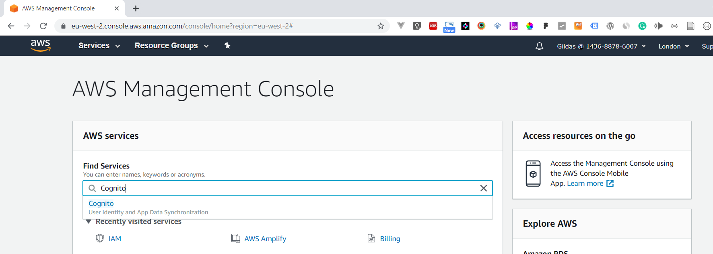

  
# How to set up AWS auth service with React

Just to begin with, AWS authentication can be achieved by using amplify cognito service, and this tutorial demonstrate how to achieve this in a React Application.    
    
**Step 1: Set up amplify**    
 We are supposing to have npm installed in our machine and git bash, Cmder or any other command line tool.    
    
The first thing to do is to install **amplify-cli** globally which will help us to configure the project and connect it to the aws account.    
    
This is achieved by opening the command line and run `npm i -g amplify-cli`    
     
    
**Step 2: Create a new React project**    
 For creating a react project we have to install a react cli by running `npm install -g cli-react`    
     
    
And create a new React app `npx create-react-app amplify-auth-react`    
     
    
    
    
With new React app in place, we are able to view it in the browser by running     
`npm start` from the app directory and a beautiful landing page is visible from the url: `http://localhost:3000`    
     
    
**Step 3: Initialize amplify**    
 After creating a new React project we are ready to start a initialize amplify in our project, and we can do this by running `amplify init` in the root directory of our application.    
    
    
  
And by setting the application with the above details in the default browser we are asked to log into aws console account. After logging in we have to get back to the command line tool and hit `Enter key`  
      
  
And we are asked to choose the region and username to be used  
    
    
  
We are then asked to press `Enter key` and this will open in  the default browser a page to create the user.  
    
    
  
Without changing the configuration, let's click `Next: Permissions`  
      
  
and  `Next: Tags`  
      
  
and  `Next: Review`  
      
  
And the we hit `Create user` for creating a new user.  
    
    
  
After a page with user `Access Key ID` and `Secret access key` shows up, and from there we can copy them and use them in our command line.  
    
    
  
After pasting these details we let the profile name to `default` and hit `Enter` and wait for a while and let the app to be created.  
    
  
  
After that the amplify is all set and ready to be used in the application.  
  
After all these steps, a folder named `amplify` is generated in the root folder of our app, and a some configuration are auto-generated in `src/aws-exports.js`  
  
***NB:** After setting up amplify in our project, the default region and default user details are stored in 2 files `config` and `credentials` located in `C:\Users\[User]\.aws` folder in for Windows users. This will skip the new user creation and set up the region, next time when another amplify project will be created.*  
  
**Step 4: Set React app to use AWS auth**   
To make the app aware of using amplify, we will need to install **aws-amplify** with `npm i aws-amplify aws-amplify-react` and set it in the `src/index.js` file by adding these lines:  
  
 ... import Amplify from 'aws-amplify';   import config from './aws-exports';    
   Amplify.configure(config);  
 ...  
After that, we will need to make the app use the authentication service, and this is achieved thanks to the auth api. Here we will need to install it by running `amplify add auth` always inside the root folder of our application. And it will use the AWS Cognito built in Cognito service, which handles the authentication. And we are prompted to either require our users to log using `username`, `Email` , `Phone number` or `Email and Phone number`.  
  
  
  
And then we will run `amplify push` in order to push our configurations in aws account, and when asked to use continue the process, we choose `Y` for yes, and the update in the cloud will take some seconds.  
  
  
  
To verify weither the resources are created in the cloud, we can open the AWS Cognito Console, by going in AWS Console and search for Cognito Service:   
  
  
  
  
  
And we hit on `Manage user pools` button and we get on the page were we have the resources name as one we saw in when we were running **amplify push**  
  
With all these setting in place, the application is now ready to require any visitor to be authenticated in order to access it, and the only one configuration required is to go in the the `src/App.js` file, import the **withAuthenticator** method, and wrap the main app component in it:  
  
 ... import {withAuthenticator} from 'aws-amplify-react'; ... export default withAuthenticator(App);  
This way, when the app is started a beautiful Authentication (Sign in and Sign up) forms will be available before accessing the landing page we were seeing in the **Step 2**.  
  
From these form, the user should be able to create an account, and login to access the application.  
  
  
  
  
  
  
  
  
  
**Step 3: Publish our application**   
And finally,  as this is the app is running on local machine, it's also possible to publish all our resources and let them be accessible online, from AWS account hosting.  
  
This can be made by running `amplify hosting add`  
  
  
  
 and then `amplify publish` which takes some minutes to be done successfully.  
  
  
  
  
  
And by copying the link provided after publishing (`https://d1u40gyqxkw7xg.cloudfront.net` in our case here), and pasting it in the browser url bar, we get our app but this time online.  
  
  
  
***This is how to set the Authentication using AWS Cognito service!!!***  
  
**The project demo repo**
[amplify-auth-react](https://github.com/gildniy/amplify-auth-react)
